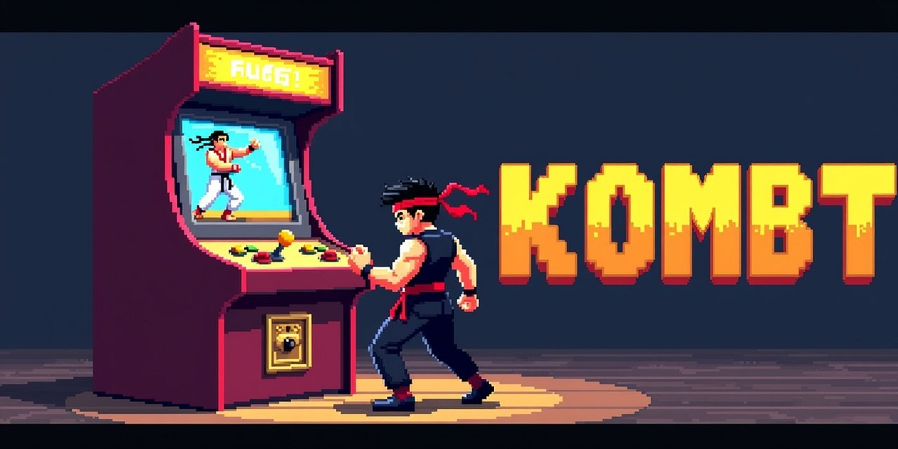
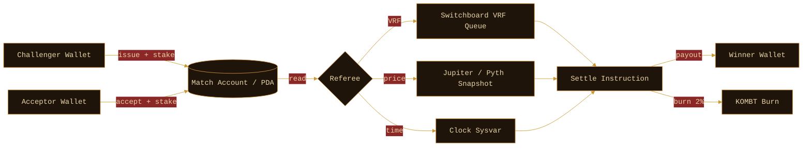

<p align="center">
  
</p>

<p align="center">
  <a href="https://kombt.fun" target="_blank"></a>
  <a href="https://kombt.fun/arena" target="_blank"></a>
  <a href="https://x.com/kombtfun" target="_blank"></a>
</p>

<p align="center">
  
  
  
  
  
  
</p>

# kombt-protocol

Insert coin. Fight.

`kombt-protocol` is the on-chain primitive set behind **Kombt**, a 1v1 token-combat
protocol on Solana. Each match is an isolated escrow between two wallets refereed
by a Switchboard VRF feed, a price oracle snapshot, or a wall-clock timeout.
The crowd is for prediction markets. The duel is for KOMBT.

This repo contains:

- The Anchor program (`programs/kombt`) implementing match + challenge primitives.
- A TypeScript SDK (`sdk/typescript`) that wraps account derivation, transaction
  builders, and helpers for Phantom / Solflare / Backpack wallets.
- Documentation under `docs/` covering match formats and integration steps.

## How a duel works



## Match formats

| Format | Trigger | Health Bar |
|--------|---------|-----------|
| `Price` | snapshotEnd vs snapshotStart on a price feed | bar tracks delta on the chosen pair |
| `Time`  | first authority that touches a stake before timeout loses | bar drains while you hold |
| `Vrf`   | Switchboard VRF returns 0 or 1 | bar randomizes the KO frame |

## Quickstart (TypeScript SDK)

```ts
import { KombtClient, MatchType } from "kombt-sdk";

const client = await KombtClient.connect({
  rpc: "https://api.mainnet-beta.solana.com",
  programId: "ELbd3fkvCeqDCrHdoZ2FLzCyo5jNynik2bLzpSFyGcqs",
});

const tx = await client.match.create({
  challenger: wallet.publicKey,
  stakeAmount: 250n,
  stakeToken: "KOMBT",
  matchType: MatchType.Vrf,
  expiresInMinutes: 60,
});

const sig = await wallet.sendTransaction(tx, client.connection);
console.log("match scheduled:", sig);
```

## Quickstart (Anchor program)

```bash
anchor build
anchor test
```

The local validator is configured for `programs/kombt`; tests cover create,
accept, settle, and cancel paths for all three match formats. The `Anchor.toml`
file pins the toolchain to `solana 1.18` + `anchor 0.30`.

## Repository layout

```
programs/
  kombt/
    src/
      lib.rs
      errors.rs
      constants.rs
      state/
        match_state.rs
        challenge.rs
      instructions/
        create_match.rs
        accept_match.rs
        settle_vrf.rs
        settle_price.rs
        issue_challenge.rs
        cancel.rs
      utils/
        escrow.rs
        oracle.rs
sdk/
  typescript/
    src/
      index.ts
      client.ts
      match.ts
      challenge.ts
      types.ts
      errors.ts
docs/
  ARCHITECTURE.md
  MATCH_TYPES.md
  GETTING_STARTED.md
```

## Documentation

- [`docs/ARCHITECTURE.md`](docs/ARCHITECTURE.md) — high-level layering of program, SDK, and oracle dependencies.
- [`docs/MATCH_TYPES.md`](docs/MATCH_TYPES.md) — settlement semantics for each format, including tie-breakers and refund paths.
- [`docs/GETTING_STARTED.md`](docs/GETTING_STARTED.md) — end-to-end devnet walkthrough.

## Roadmap (open questions)

- Switchboard VRF v3 migration once the queue is GA on mainnet.
- Stake token whitelist governance — currently maintained as a hard-coded list.
- Cancel-after-timeout window tuning. The default is 24h; longer formats need a
  per-match override.

## License

MIT — see `LICENSE`.

<!-- rev32 -->

<!-- rev47 -->

<!-- rev55 -->

<!-- rev86 -->

<!-- rev93 -->

<!-- rev96 -->
