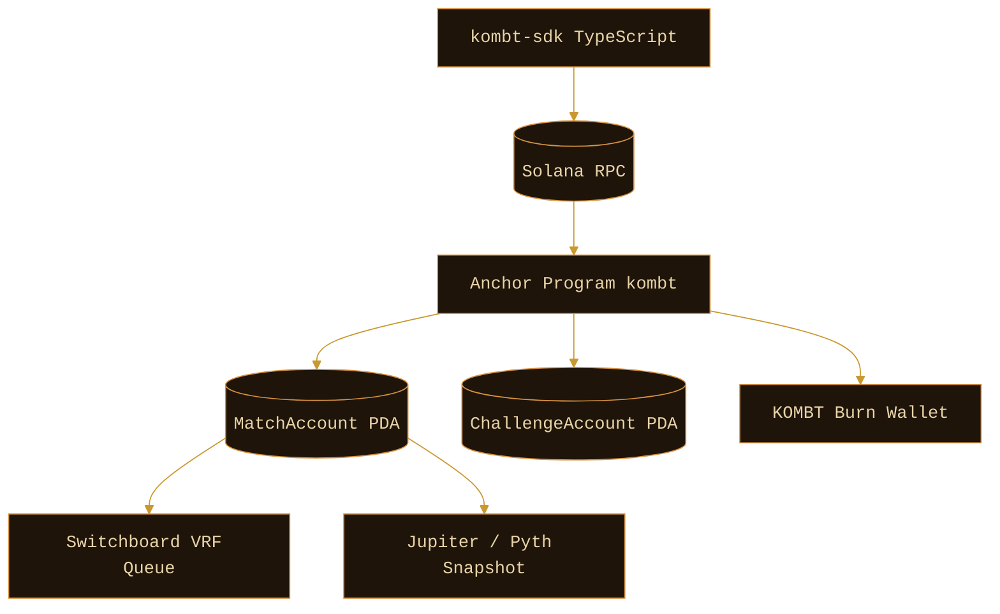

# Architecture

The Anchor program is the only authority for moving stakes between
participants. The TypeScript SDK exposes account derivation, transaction
builders, and helper formatting utilities.

## Layered responsibilities

- `programs/kombt`: on-chain primitives. Owns escrow, settlement, and burn.
- `sdk/typescript`: client-side helpers used by the website, telegram bot, or
  external integrations.
- `docs`: human-facing reference for integrators.

## Settlement primitives

Each match is settled by exactly one of three primitives:

- VRF — Switchboard randomness.
- Price — single integer snapshot at expiry.
- Time — first wallet that touches its balance loses.

<!-- rev0 -->

<!-- rev1 -->

<!-- rev29 -->

<!-- rev43 -->

<!-- rev80 -->

<!-- rev82 -->

<!-- rev87 -->

<!-- rev95 -->

<!-- rev106 -->

<!-- rev115 -->

<!-- rev126 -->

<!-- rev133 -->

<!-- rev134 -->

<!-- rev149 -->

<!-- rev159 -->

<!-- rev178 -->
